# Features

A tour of what family-finances does today. Every capability listed here has
a corresponding [OpenSpec](../openspec/) spec under `openspec/specs/` — this
document is the human-readable overview, the specs are the source of truth
for exact behavior.

## Contents

- [Authentication](#authentication)
- [Accounts](#accounts)
- [Entries (transactions)](#entries-transactions)
- [CSV/JSON import](#csvjson-import)
- [Recurring transactions](#recurring-transactions)
- [Categories](#categories)
- [Tags](#tags)
- [Reports](#reports)
- [Home dashboard](#home-dashboard)
- [Sharing](#sharing)
- [Multi-user administration](#multi-user-administration)
- [Personalization](#personalization)

## Authentication

Passwordless sign-in: enter an email address and get a single-use magic
link, no password to set or remember. An admin can optionally configure a
single OIDC provider for SSO, which then appears as an extra button on the
same login screen. Self-signup, an email domain allow-list, and invite-only
onboarding are all independently configurable.

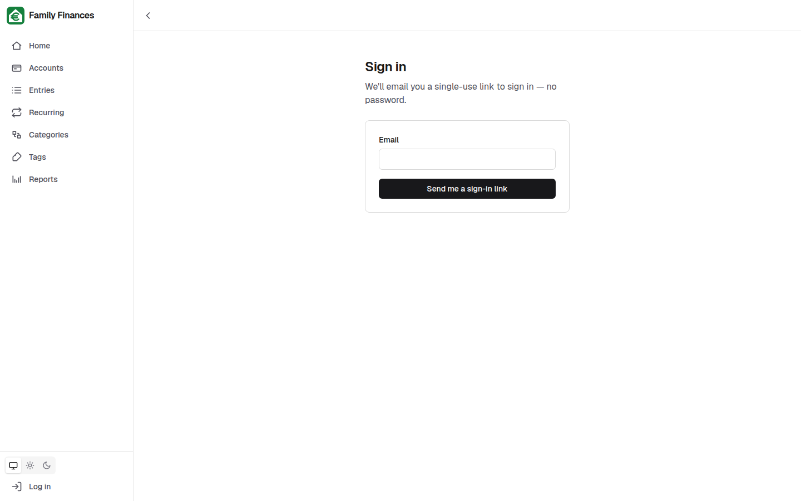

## Accounts

Every account a household tracks — checking, cash, credit cards,
investments — with a title, type, currency, financial institute, and
opening/closing dates. The overview shows every account's live balance at a
glance, colored red/green by sign, plus its open/closed status.

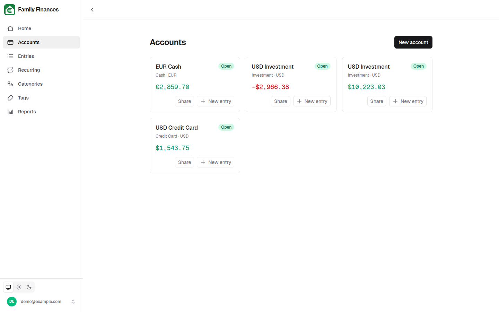

An account's detail page shows its full fields plus its recent entries:

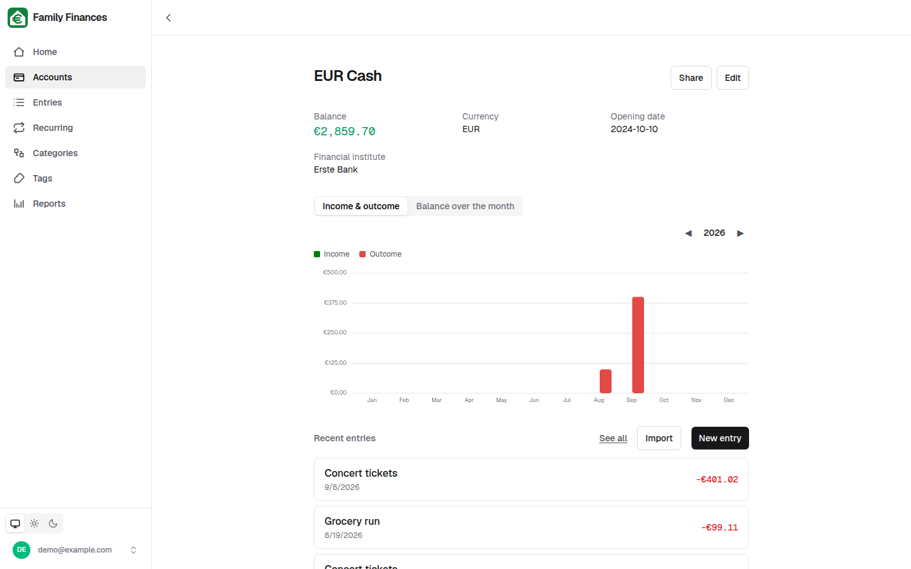

Accounts can be disabled (reversibly hidden from active use) or soft
deleted, and each carries an optional icon and color for quick visual
recognition throughout the app.

## Entries (transactions)

The full transaction ledger for every account you can see: filterable by
account, category, tag, and kind, searchable by title, sortable, and
infinitely scrolling. A date-range control offers common presets ("this
month", "last 7 days", …) or a custom range, and the whole filter state
lives in the URL so a filtered view is bookmarkable and shareable.

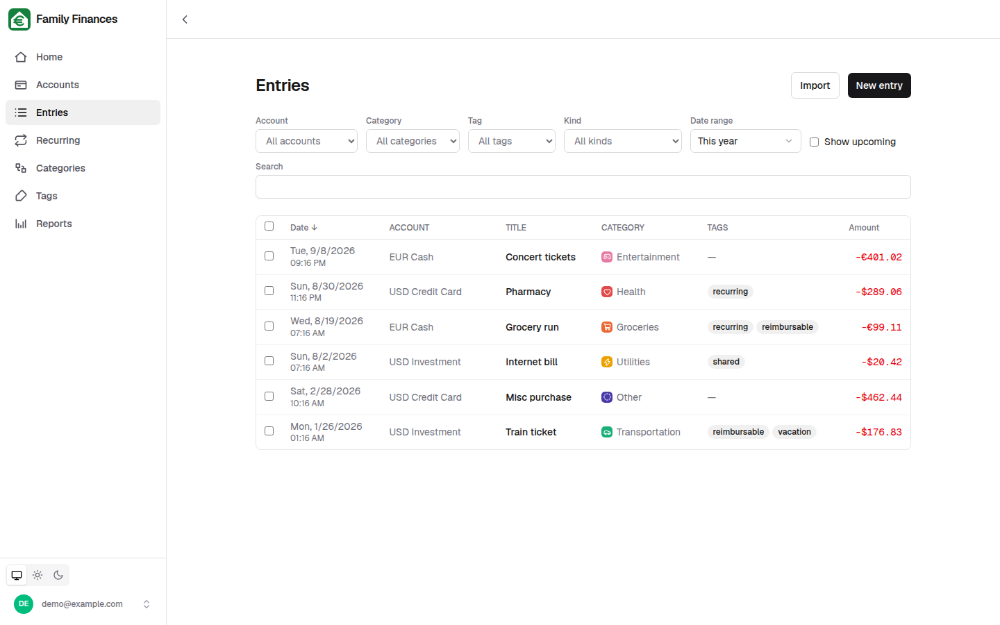

Entries can be plain transactions or balance adjustments, each optionally
tagged and categorized; tags can be created inline while entering a new
entry.

## CSV/JSON import

A guided wizard for bulk-importing a bank export: pick the destination
account, upload a CSV or JSON file, map its columns to entry fields, review
a client-side dry run with per-row remapping, then run the import with live
progress and a results summary.

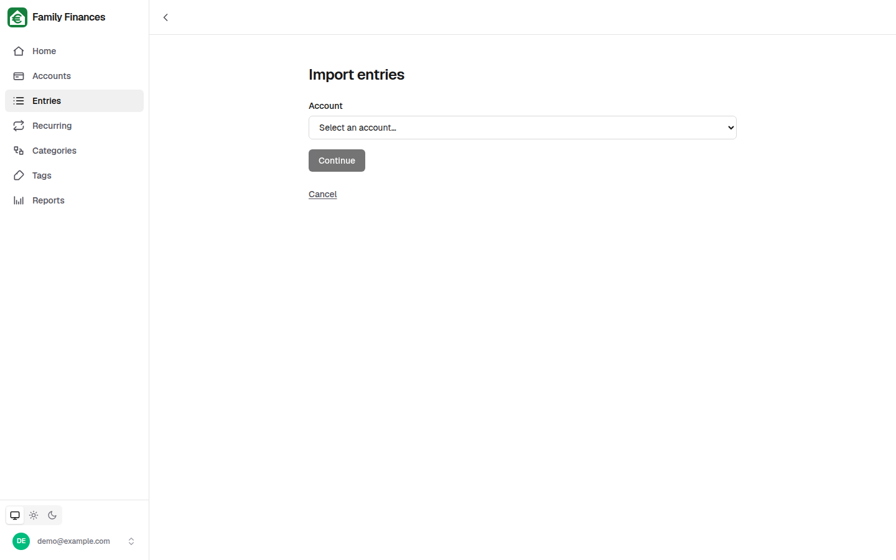

## Recurring transactions

Templates for the income and expenses that repeat on a schedule — rent,
subscriptions, salary, insurance — each with an interval, start date, and
optional end date. The list shows each template's per-year amount and a
household total per currency. Nothing posts automatically: creating an
actual entry from a template is always an explicit click, which opens the
entry form prefilled from the template.

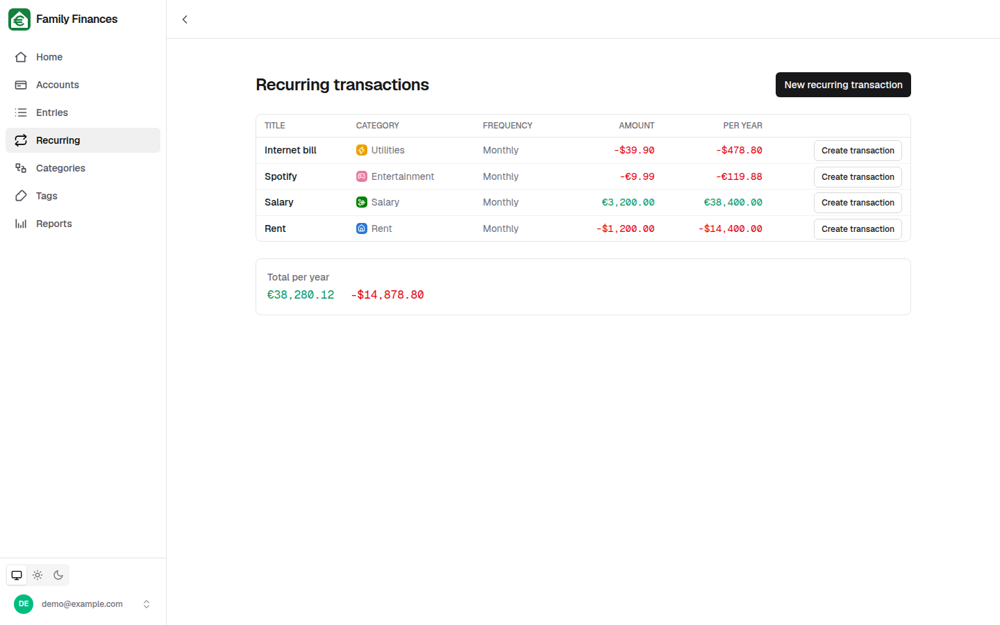

## Categories

A per-user, tree-structured category system for classifying entries —
required on a transaction, optional on a balance adjustment. Categories can
be nested, reordered among siblings, reparented, and given an icon and
color, all through button-driven controls that work as well on a phone as
on a desktop.

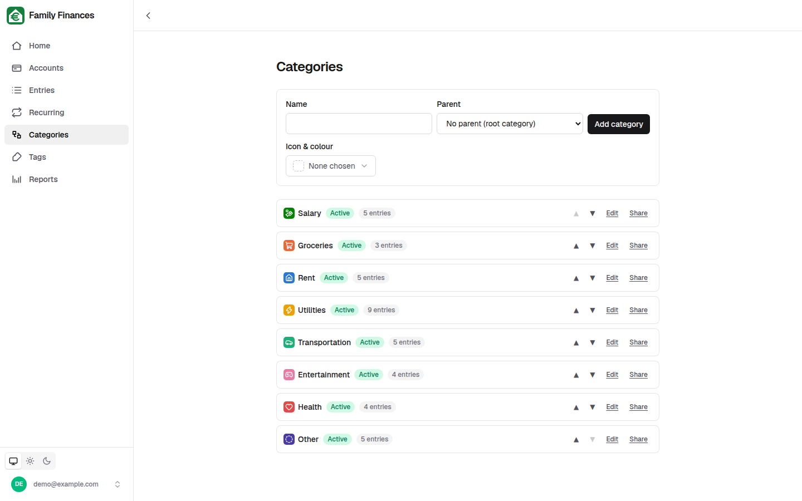

## Tags

Lightweight, per-user labels for cross-cutting organization ("recurring",
"reimbursable", "vacation") that don't fit the category tree. Tags can be
created inline from the entry form or managed on their own page —
renamed, disabled, or deleted.

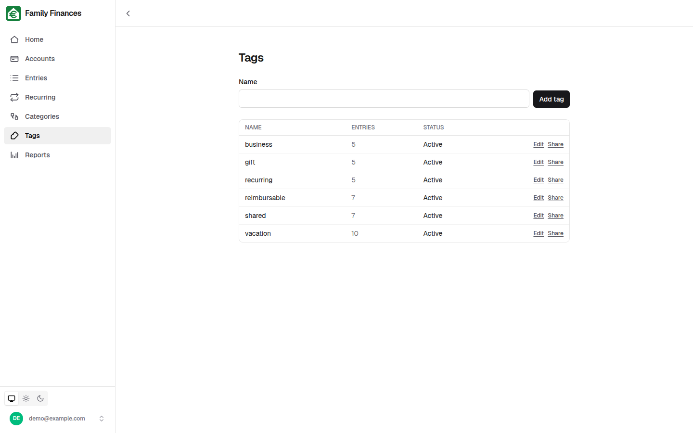

## Reports

An on-demand summary: filter by category (optionally including its
subcategories), tag, account, and date range — any combination, or none —
then explicitly generate a report of the matching entries and their total
per currency. Nothing is fetched automatically as filters change, so
building up a query is cheap.

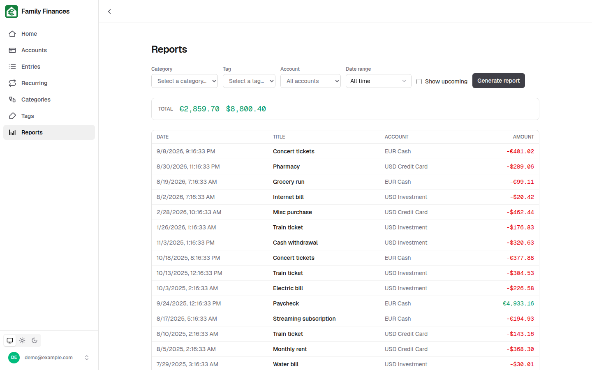

## Home dashboard

A customizable, per-user landing page built from cards: an account's live
balance, a filtered sum, a list of recent matching entries, or an
income/outcome bar chart. Edit mode lets you add, remove, reorder
(move-up/move-down), and reconfigure cards — no drag-and-drop, so it's as
usable on mobile as on desktop.

## Sharing

Accounts, categories, and tags can each be shared with other registered
users by email, independently of one another:

- **Accounts** — four tiers: `view`, `append`, `entry_admin`, `owner`.
- **Categories** and **tags** — two tiers each: `view`, `append` (only the
  real owner can ever edit metadata or manage shares).

Every share page lists who has access and at what level, lets the owner
invite by email (with a nudge to send an app invite if the address isn't
registered yet), change or revoke a permission, and lets anyone else on the
list leave.

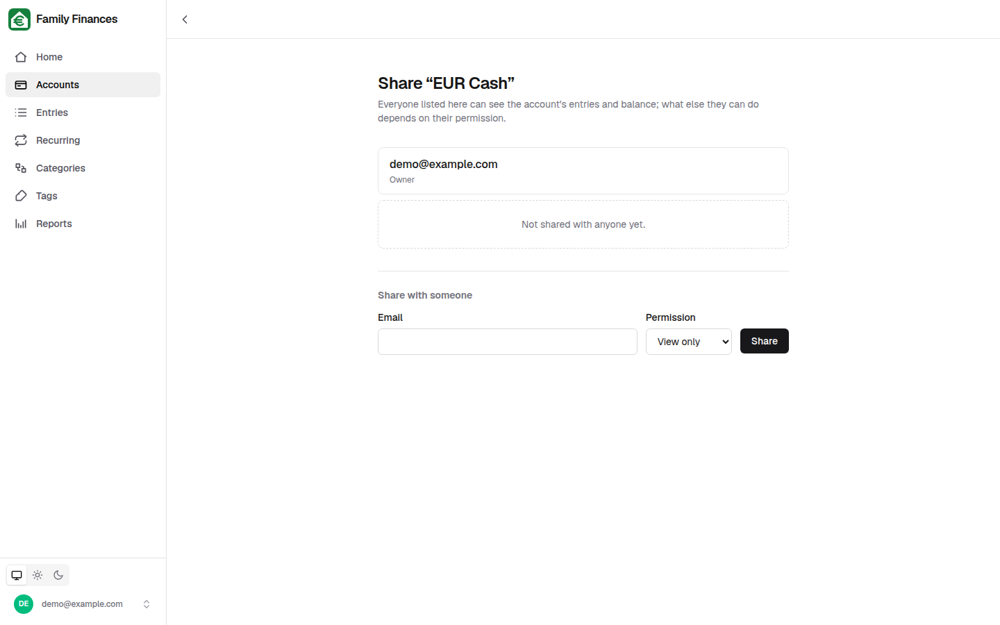

## Multi-user administration

Admins can list, invite, disable/enable, and soft-delete users, and manage
outstanding invitations — all from the Settings page's Users tab. Any
authenticated user can also see and revoke the invitations they personally
sent, without needing admin rights.

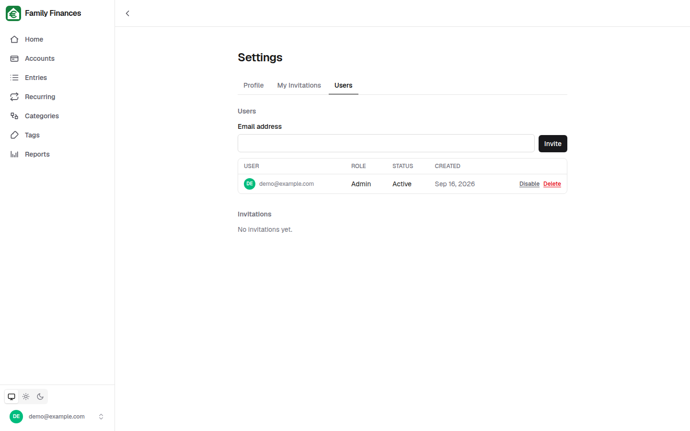

## Personalization

Per-user preferences for display language (English and German ship today),
timezone, default currency, number of displayed decimal places, and which
day the week starts on — plus a device-level light/dark/system color theme
independent of any account setting.

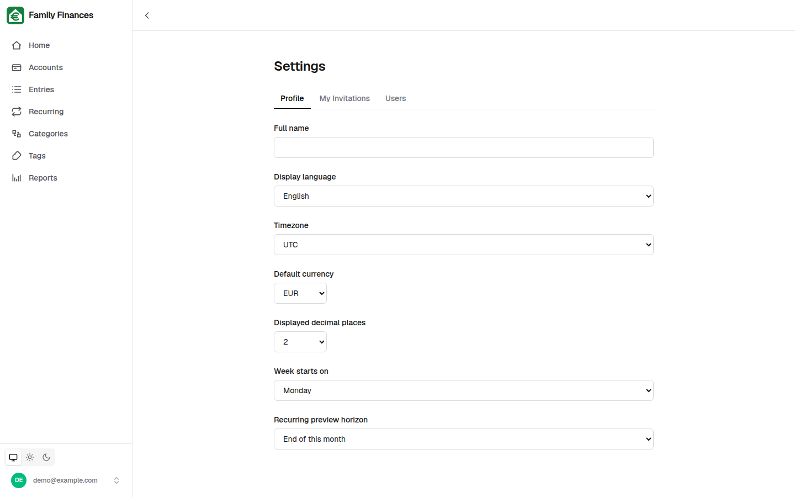
